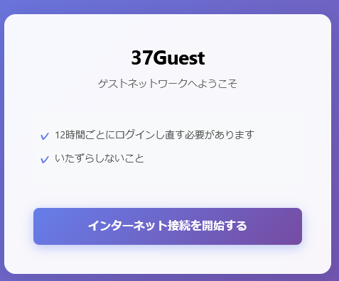
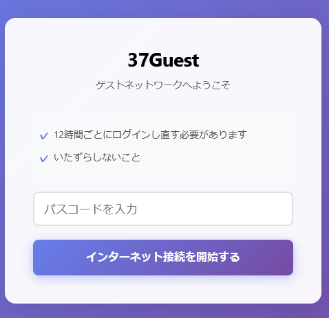
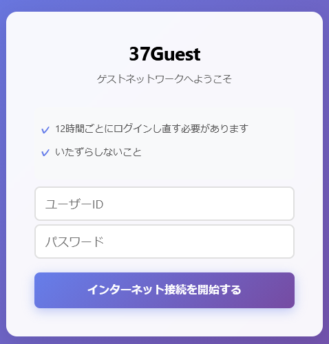

# opennds-custom

OpenNDS のカスタムテーマと、合言葉・LDAP による外部認証のためのセットアップ例をまとめたリポジトリです。  
本リポジトリには OpenNDS（OpenWrt 上で動作する Captive Portal）の見た目をカスタマイズするテーマと、外部サーバーを使って合言葉や LDAP 認証を行うためのサンプル（CGI スクリプト／設定例）を含める予定です。
※ 現在、外部認証用のサーバー側スクリプトは公開です。順次追加していきます。

「ボタンを押して開始」

合言葉による認証

ユーザー名／パスワード（LDAP）による認証

## 概要

このプロジェクトは主に次の用途を想定しています。

- OpenNDS の Captive Portal の見た目（UI）をテーマで変更する
- 認証フローを以下のいずれかに切り替えられるようにする
  - 「ボタンを押して開始」タイプ（クリック・同意のみで通過）
  - 合言葉による認証
  - ユーザー名／パスワード（LDAP）による認証
- 認証処理自体は OpenWrt 上の OpenNDS ではなく外部の CGI 実行可能なサーバーで行えるようにする（柔軟な認証連携）

---

## 特長

- テーマによる UI カスタマイズ（ロゴ、背景、ボタン、文言などの差し替えが可能）
- 認証モードを設定ファイルで切り替え：ポータル画面の見た目と認証方法を連動して変更
- 外部サーバーによる合言葉・LDAP 認証に対応（CGI／HTTP 経由で OpenNDS と連携）

---

## サポートする認証モード

1. ボタンを押して開始（同意画面）
   - 利用者が「開始」ボタンを押すだけで認可トークンを得られるシンプルなフロー
2. 合言葉（パスワード）認証
   - 合言葉を入力して認証
3. LDAP（ユーザー名・パスワード）
   - LDAP（Active Directory 等）と連携してユーザー認証を行う

---

## 動作イメージ

- ユーザーが Wi‑Fi に接続 → ブラウザで Captive Portal にリダイレクト
- 認証画面が表示される
- 認証モードに応じて入力／ボタンが変化
- 入力内容は OpenNDS 経由で外部認証サーバーに送信され、認証結果が返る
- 認証成功ならば許可（インターネットアクセスを付与）、失敗なら再度表示

---

## インストール例（OpenWrt / OpenNDS ） 

1. OpenWrt に OpenNDS をインストールします（既に導入済みであることを想定します）。
2. テーマ(theme_click-to-continue-custom-placeholders.sh)を OpenNDS のテーマ格納ディレクトリに配置します。
   - /usr/lib/opennds
3. splash.cssとopennds.jsを設置します。
   - /etc/opennds/htdocs

※ 外部サーバーのセットアップが済んでいないと動作しません。

---

## 外部サーバー（認証サーバー）構成例

- 動作要件
  - CGI を実行できる HTTP サーバー（例: Apache ）
  - ldapwhoamiコマンドが実行可能であること

